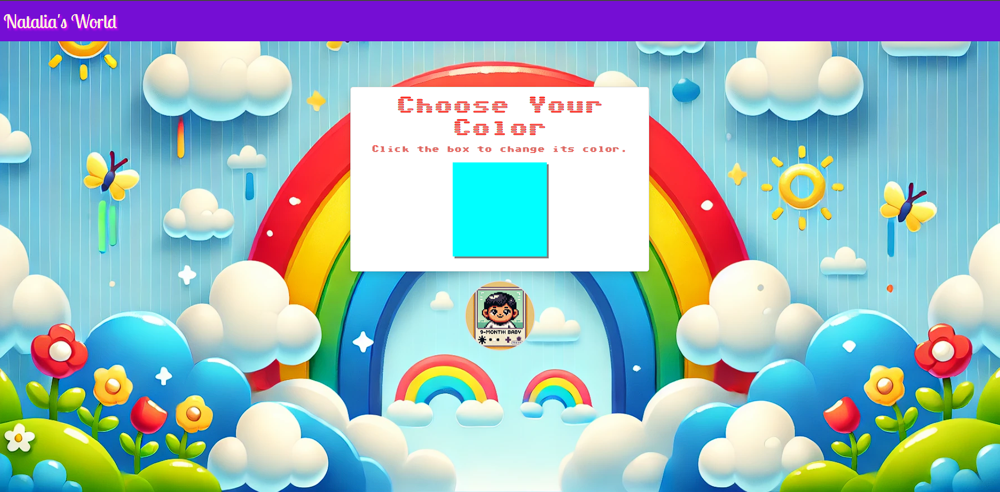

# Natalia Color Changer App

Welcome to the **Natalia Color Changer App**! This is a simple, interactive web application designed to change background colors with a click of a button. It’s fun, minimalist, and showcases basic JavaScript functionality for beginners and enthusiasts alike.

 

## ✨ Features

- **Dynamic Backgrounds**: Change the background color of the webpage with a single click.
- **User-Friendly Design**: Simple and intuitive interface for all users.
- **Lightweight and Fast**: Built with minimal dependencies for a snappy user experience.

## 🚀 Live Demo

Check out the app live at:  
[**Natalia Color Changer App**](https://joseomolon.github.io/NataliaColorChangerApp/)

## 📁 Project Structure

NataliaColorChangerApp/ │ 
                        ├── index.html # Main HTML file 
                        ├── style.css # Styling for the app
                        └── script.js # JavaScript for interactive functionality

## 🛠️ Built With

- **HTML**: For structuring the webpage.
- **CSS**: For styling the app.
- **JavaScript**: For implementing dynamic background changes.

## 🤝 Contributing

Contributions are welcome! If you have ideas for improving the app, feel free to fork the repository and submit a pull request.

## 💡 Ideas for Improvement

- Add more color schemes (e.g., gradients, themes).
- Implement a feature to save favorite colors.
- Add accessibility options like high-contrast mode.

## 🖊️ Author

**Jose Omolon**  

## 📜 License

